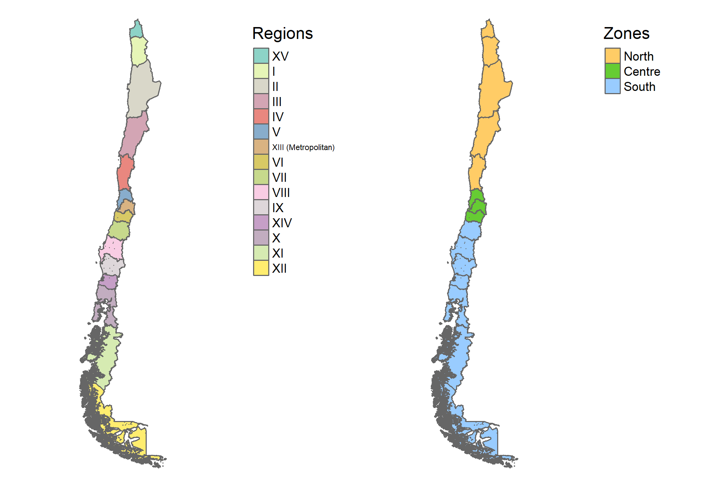
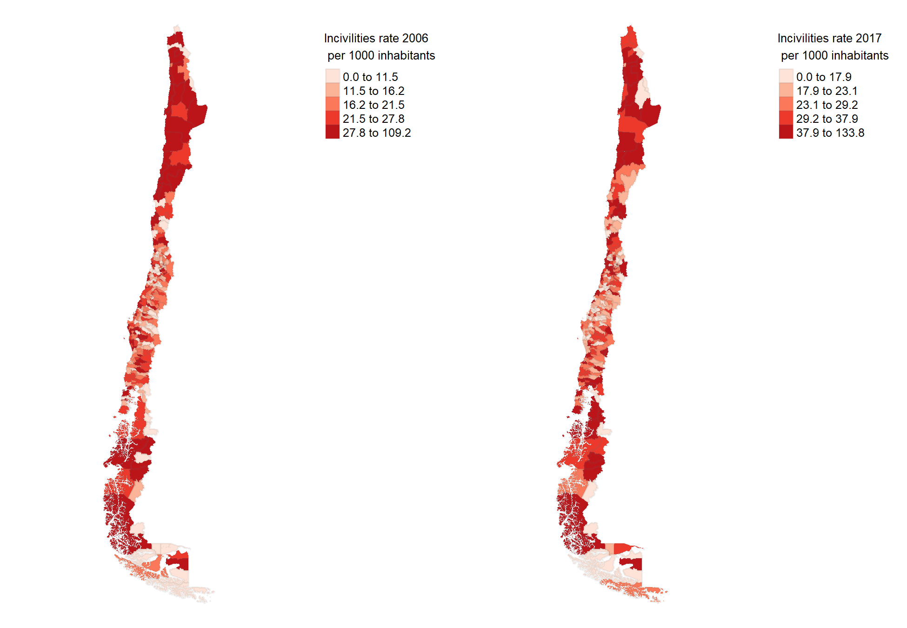
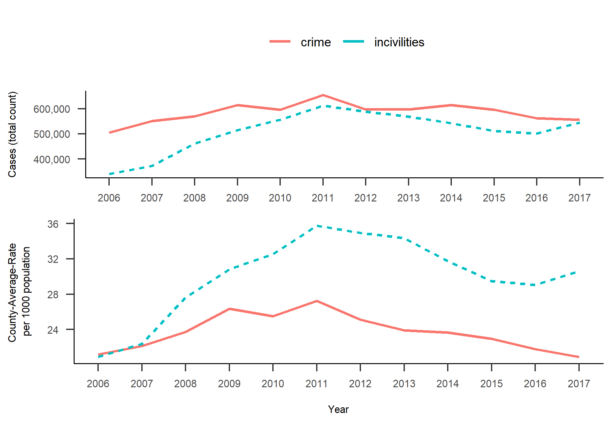
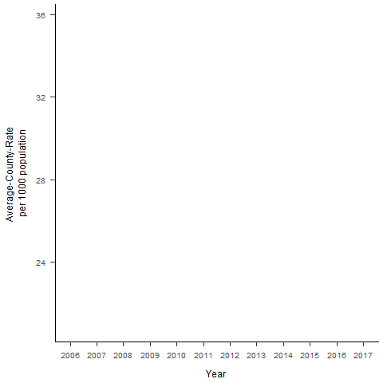
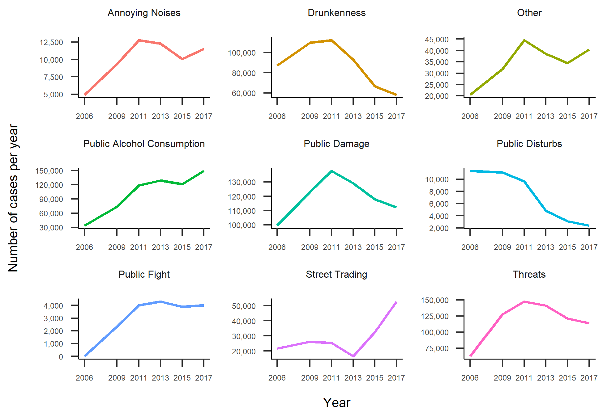
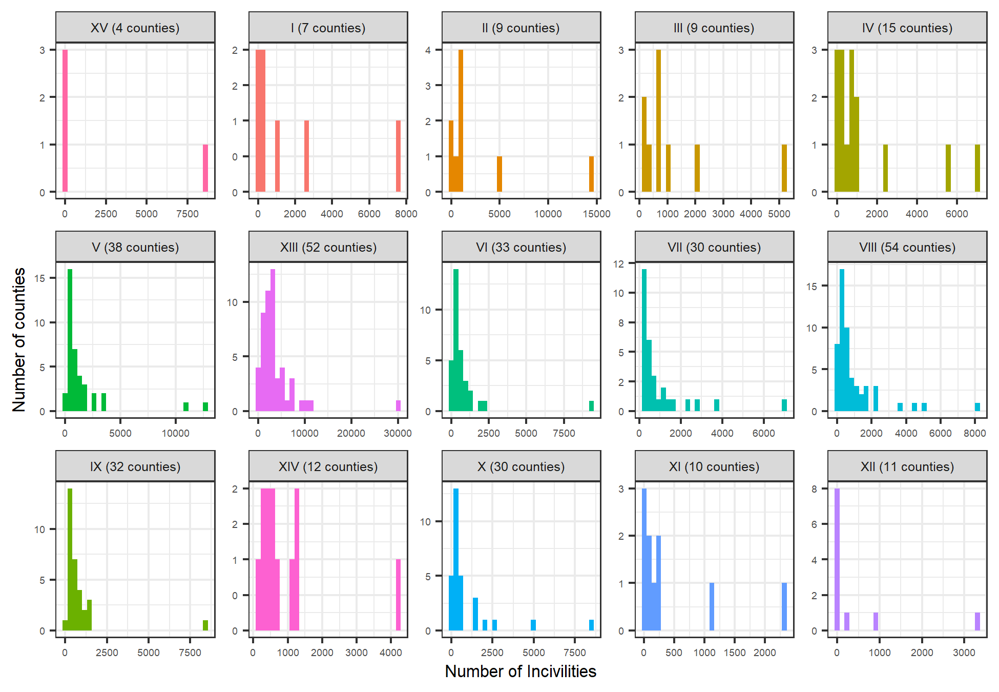
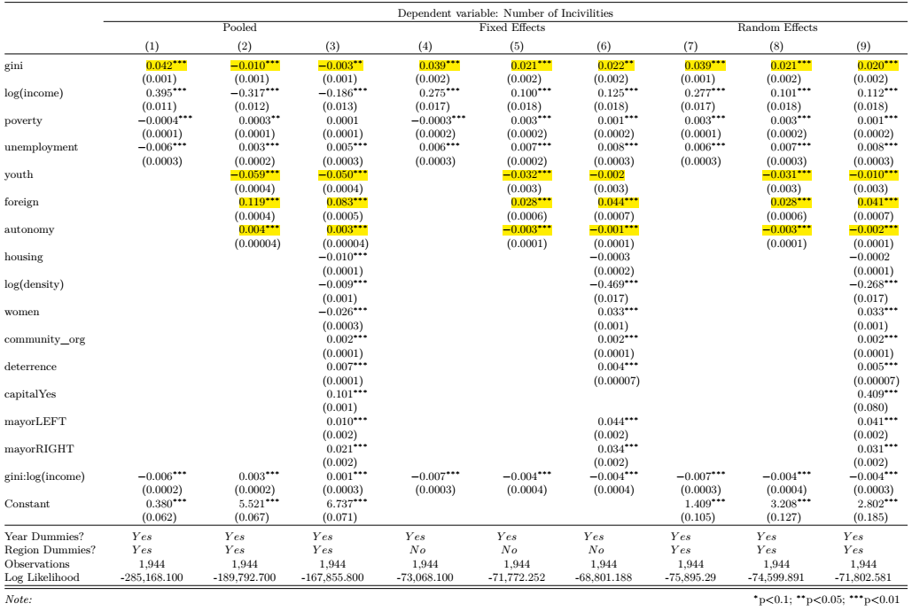

class: center, middle, inverse
background-image: url(images/MARCHA.jpg)
background-size: cover

--

# Motivation

--

# "If income gaps are not reduced, the next crisis will happen as surely as autumn follows summer"

--

.right[<i>An interview with Michael Kumhof by Mikael Feldbaum, https://www.eurozine.com, 2012</i>]

???
"A picture is worth a thousand words"
---
class: center, middle, inverse

# Research Problem

--

## _Income inequality_ could have a significant effect on _social cohesion_ and instability, spreading its influence like a *disease*

--

.left[
+ Potential negative _consequences_ of increasing inequality:
  + *Unemployment*, *indebtedness*, *political instability* and *economic growth*(Berg & Ostry,2011).   
  + *Health*, *education*, *social and economic mobility* and *trust* (Atkinson, 2015).
]

--

.left[
+ *Secondary role* in the design of economic policy]

--

.left[
+ How can we capture the effect of income inequality on *social cohesion*?]

???
+ The above is reflected in:
  - justifications to delay reforms
  - data availability
+ The main contribution of this research: Better understanding of the causes and consequences of income inequality in NRRC

+ Definition for social cohesion: The **capacity to acknowledge the existence of different social and territorial groups** present in the city, their **diverse and sometimes contradictory interests** as well as the **capacity** for these groups **to organise themselves** and **for the city to create institutions in which these groups can confront each other and decide about the city’s future** (Cassiers & Kesteloot, 2012)
---
# What are "Incivilities"? 

--

>Incivilities are those visible disorders in the public space that violate respectful social norms and tend not to be treated as crimes by the criminal justice system

--

There two types of incivilities:
+ **Social incivilities** include antisocial behaviours such as public drinking, noisy neighbours, fighting in public places and street drug sales. 

--

+ **Physical incivilities** include, among others, vandalism, graffiti, abandoned cars and garbage on the streets.

--

# What is the problem?
#### Broken Window Theory

> Higher rates of incivilities are a signal of social disorganization
which result in higher crime rates (Wilson & Kelling, 1982)

<div class="my-footer"><span>Does economic disadvantage diminish social cohesion? 
&emsp;&emsp;&emsp;&emsp;&emsp;&emsp;&emsp;&emsp;&emsp;&emsp;&emsp;&emsp;&emsp;
&emsp;&emsp;&emsp;&emsp;&emsp;&emsp;&emsp;&emsp;&emsp;&emsp;&emsp;&emsp;&emsp;
</span></div> 
---
# Research so far

>The negative impact of incivilities is not merely reflected in its **association with crime rates** (Skogan, 2015)

--

Incivilities have been associated with:
+ **Health problems** (Branas et al., 2011; Cohenet al., 2000; Hill & Angel, 2005; Ross, 2011; Ross & Mirowsky, 2001)

--

+ **Greater victimization** and **fear of crime** (Brunton-Smith, Jackson, & Sutherland, 2014; Mijanovich & Weitzman, 2003)

--

+ Multiple negative **economic effects**:
  + Reduction in commercial activity, lower investment in real estate and reduction in house prices (Skogan, 2015)
  + Population instability (Hipp, 2010).

<div class="my-footer"><span>Does economic disadvantage diminish social cohesion? 
&emsp;&emsp;&emsp;&emsp;&emsp;&emsp;&emsp;&emsp;&emsp;&emsp;&emsp;&emsp;&emsp;
&emsp;&emsp;&emsp;&emsp;&emsp;&emsp;&emsp;&emsp;&emsp;&emsp;&emsp;&emsp;&emsp;
</span></div> 
---
# Research so far

--

#### The "Incivilities Thesis"

>Incivilities are caused by inequality and the lack of informal mechanisms of social control. **The patterns of incivilities should mirror the patterns of inequality** (Taylor, 1999)

--

#### Chilean evidence: 
+ Focussed on crime and showing weak and ambiguous results

--

  + **Indicators of socio-economic disadvantage** would only have significant effects on property crime (Beyer & Vergara, 2006; Nuñez, Rivera, Villavicencio, & Molina, 2003; Rivera, Gutiérrez, & Núñez,2009). 

--

  + **Crime deterrence variables**: The probability of being caught or the number of police resources (Beyer & Vergara, 2006; Rivera et al., 2009; Vergara, 2012).

<div class="my-footer"><span>Does economic disadvantage diminish social cohesion? 
&emsp;&emsp;&emsp;&emsp;&emsp;&emsp;&emsp;&emsp;&emsp;&emsp;&emsp;&emsp;&emsp;
&emsp;&emsp;&emsp;&emsp;&emsp;&emsp;&emsp;&emsp;&emsp;&emsp;&emsp;&emsp;&emsp;
</span></div> 

???
In Chile there is no evidence about causes of incivilities, but the Broken Windows Theory has been used to argue new punitive actions to reduce crime, victimization and the feeling of insecurity in the population 
---
class: center, middle, inverse

# Research Question

--

### Do differences in the rate of incivilities mirror differences in income inequality between counties? 

--

# Research Hypothesis

--


### "Incivilities will be higher in more unequal counties"  

<div class="my-footer"><span>Does economic disadvantage diminish social cohesion?
&emsp;&emsp;&emsp;&emsp;&emsp;&emsp;&emsp;&emsp;&emsp;&emsp;&emsp;&emsp;&emsp;
&emsp;&emsp;&emsp;&emsp;&emsp;&emsp;&emsp;&emsp;&emsp;&emsp;&emsp;&emsp;&emsp;
</span></div> 

???
In general, the relationship (effect) with incivilities depend on whether the variable is associated with a higher (lower) reported rate and/or whether it associated with a higher "probability to commit negligent or antisocial behaviour" (reduction in informal control) 

#### $H_2$: Incivilities will be higher in counties with a high proportion of the young population.

#### $H_3$: Incivilities will be higher in counties with a high proportion of foreign inhabitants.

#### $H_4$: Incivilities will be lower in counties managed by municipalities more autonomous from central government transfers.

---

# Data and variables

--

+ Data on the number of **incivilities** were obtained from the **“Centre of Studies and Analysis of Crime”** (Chilean government) 

--

+ Data on income correspond to six waves of the "Socioeconomic Characterization Survey", CASEN (2006-2009-2011-2013-2015-2017) 

--

+ The municipal information corresponds to the "National System of Municipal Information", SINIM.

--

+ Population data from the "National Institute of Statistics", INE 

--

+ In total 1944 observations (324 counties in 6 years)

<div class="my-footer"><span>Does economic disadvantage diminish social cohesion?
&emsp;&emsp;&emsp;&emsp;&emsp;&emsp;&emsp;&emsp;&emsp;&emsp;&emsp;&emsp;&emsp;
&emsp;&emsp;&emsp;&emsp;&emsp;&emsp;&emsp;&emsp;&emsp;&emsp;&emsp;&emsp;&emsp;
</span></div> 
---
# Data and variables

--
+ Dependent variable:     $\qquad inciv\_rate_{it}=\frac{incivilities_{it}}{n_{it}}*1000$

--

Where $incivilities$ is the number of incivilities, $inciv\_rate$ the rate per 1000 inhabitants, $t$ is the year, $i$ the county and $n$ is the county population.

--

+ Main independent variable: The **Gini coefficient** is calculated for each county
and included through the variable _gini_.

--

+ Controls: 

--

  + Indicators of "absolute economic disadvantage" (income, unemployment rate, poverty rate)
  + Demographic (percentage of young population, percentage of female population, percentage of foreign population, population density)
  + Social (percentage of household owners, number of community organizations)
  + Deterrence (ratio between the reported number of arrest and the total number of reported incivilities cases)
  + Municipal (autonomy, political support of the mayor)
  + Geographical (Regional dummies)
  

<div class="my-footer"><span>Does economic disadvantage diminish social cohesion? 
&emsp;&emsp;&emsp;&emsp;&emsp;&emsp;&emsp;&emsp;&emsp;&emsp;&emsp;&emsp;&emsp;
&emsp;&emsp;&emsp;&emsp;&emsp;&emsp;&emsp;&emsp;&emsp;&emsp;&emsp;&emsp;&emsp;
</span></div> 

---
class: center
## How is the country geographically divided?



<div class="my-footer"><span>Does economic disadvantage diminish social cohesion? 
&emsp;&emsp;&emsp;&emsp;&emsp;&emsp;&emsp;&emsp;&emsp;&emsp;&emsp;&emsp;&emsp;
&emsp;&emsp;&emsp;&emsp;&emsp;&emsp;&emsp;&emsp;&emsp;&emsp;&emsp;&emsp;&emsp;
</span></div> 
---
class: center

### Spatial distribution incivilities rate per 1000 inhabitants



<div class="my-footer"><span>Does economic disadvantage diminish social cohesion? 
&emsp;&emsp;&emsp;&emsp;&emsp;&emsp;&emsp;&emsp;&emsp;&emsp;&emsp;&emsp;&emsp;
&emsp;&emsp;&emsp;&emsp;&emsp;&emsp;&emsp;&emsp;&emsp;&emsp;&emsp;&emsp;&emsp;
</span></div> 

---
class: center
### Evolution Average County Rate of Incivilities per 1000 inhabitants

 
 <!--  --> 
 
<div class="my-footer"><span>Does economic disadvantage diminish social cohesion? 
&emsp;&emsp;&emsp;&emsp;&emsp;&emsp;&emsp;&emsp;&emsp;&emsp;&emsp;&emsp;&emsp;
&emsp;&emsp;&emsp;&emsp;&emsp;&emsp;&emsp;&emsp;&emsp;&emsp;&emsp;&emsp;&emsp;
</span></div> 

---
name: incivcat
class: center
### Evolution Total Number of Incivilities by Category



<div class="my-footer"><span>Does economic disadvantage diminish social cohesion? 
&emsp;&emsp;&emsp;&emsp;&emsp;&emsp;&emsp;&emsp;&emsp;&emsp;&emsp;&emsp;&emsp;
&emsp;&emsp;&emsp;&emsp;&emsp;&emsp;&emsp;&emsp;&emsp;&emsp;&emsp;&emsp;&emsp;
</span></div>

???
How is the distribution of the total number of incivilities?
---
class: center
### Annual Average Number of Incivilities per County


<div class="my-footer"><span>Does economic disadvantage diminish social cohesion? 
&emsp;&emsp;&emsp;&emsp;&emsp;&emsp;&emsp;&emsp;&emsp;&emsp;&emsp;&emsp;&emsp;
&emsp;&emsp;&emsp;&emsp;&emsp;&emsp;&emsp;&emsp;&emsp;&emsp;&emsp;&emsp;&emsp;
</span></div> 

---
class: center, middle, inverse

# Methodology
---

# Method: Panel Count Data models

+ Considering as the response variable the number of incivilities:

--

\begin{equation}
\lambda_{it} =exp(\beta_0 + \beta_1gini_{it} + X\gamma+\alpha_i +\theta_t)
\end{equation}

--

+ where
  + $\lambda$ is the rate of incivilities, 
  + $X$ is our vector of controls, 
  + $\alpha's$ are county-specific constants and 
  + $\theta's$ are time-specific constants. 

--

+ To account for differences in county population, we have:

--

\begin{equation}
\frac{\lambda_{it}}{(\frac{population_{it}}{1000})} =exp(\beta_0 + \beta_1gini_{it} + X\gamma+\alpha_i +\theta_t)
\end{equation}

--

+ The model estimated using Maximum Likelihood Estimation (MLE) is:

--

\begin{equation}
log(\lambda_{it}) = \beta_0 + \beta_1gini_{it} + X\gamma+\alpha_i +\theta_t+log(\frac{population_{it}}{1000})
\end{equation}

<div class="my-footer"><span>Does economic disadvantage diminish social cohesion?
&emsp;&emsp;&emsp;&emsp;&emsp;&emsp;&emsp;&emsp;&emsp;&emsp;&emsp;&emsp;&emsp;
&emsp;&emsp;&emsp;&emsp;&emsp;&emsp;&emsp;&emsp;&emsp;&emsp;&emsp;&emsp;&emsp;
</span></div> 

---
class: center, middle, inverse

# Results

---
class: center
name: poisson
### Results: [Poisson](#interpretation) [Regression](#nb)



<div class="my-footer"><span>Does economic disadvantage diminish social cohesion?
&emsp;&emsp;&emsp;&emsp;&emsp;&emsp;&emsp;&emsp;&emsp;&emsp;&emsp;&emsp;&emsp;
&emsp;&emsp;&emsp;&emsp;&emsp;&emsp;&emsp;&emsp;&emsp;&emsp;&emsp;&emsp;&emsp;
</span></div> 

---
# Main results and discussion

--

+ We found strong evidence of a **significant and positive association between the rate of incivilities and income inequality**. 

--

+ Policies aimed at controlling the behaviour of **young people** do not have strong empirical support. 

--

+ The significant increase in the **foreign population** seems to be associated with a significant increase in the problem of incivilities. 

--

+ Efforts managed from the **municipalities** can be an important complement to those from the central government.

--

+ Mayors explicitly supported by policial parties face greater challenges in terms of incivilities.


<div class="my-footer"><span>Does economic disadvantage diminish social cohesion? 
&emsp;&emsp;&emsp;&emsp;&emsp;&emsp;&emsp;&emsp;&emsp;&emsp;&emsp;&emsp;&emsp;
&emsp;&emsp;&emsp;&emsp;&emsp;&emsp;&emsp;&emsp;&emsp;&emsp;&emsp;&emsp;&emsp;
</span></div> 

???
The political result is the only one significant among the thesis studies
---
# Conclusions and Future Research

+ **Increasing income inequality** or persistently high levels might be associated with the **rise of antisocial behaviours** in the form of incivilities. 

--

+ Future research should go further on the **role of local authorities** analysing the impact of specific programs in counties with similar characteristics.

--

+ **Program evaluation** could help to elucidate the question of whether local interventions from the local governments have a causal effect on incivilities and crime rates. 

--

+ A deeper analysis of the **impact that foreign migration is having on social cohesion in the Chilean society** is an interesting avenue for future studies


<div class="my-footer"><span>Does economic disadvantage diminish social cohesion?
&emsp;&emsp;&emsp;&emsp;&emsp;&emsp;&emsp;&emsp;&emsp;&emsp;&emsp;&emsp;&emsp;
&emsp;&emsp;&emsp;&emsp;&emsp;&emsp;&emsp;&emsp;&emsp;&emsp;&emsp;&emsp;&emsp;
</span></div> 

```{r pdf, eval=FALSE, include=FALSE}
pagedown::chrome_print("C:/Users/n9675230/OneDrive - Queensland University of Technology/R/gh-repos/APCC-inequality/index_pdf.Rmd")
```
